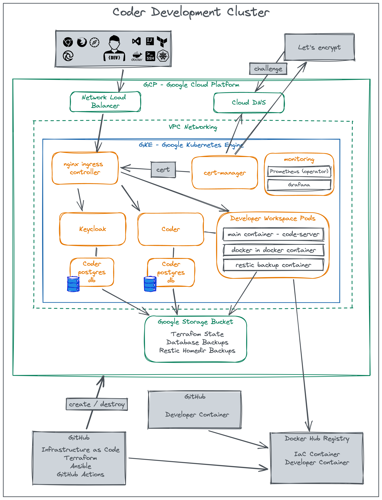

# Architecture

Here is the 'big picture' of the architecture of the coder development cluster:

## Coder

Coder is a platform for developers to run their development environment in the cloud. It is based on Kubernetes and provides a web based IDE (VSCode) and a lot of other features. For more information see [https://coder.com](https://coder.com).

## Developer Workspace Pods

The developer workspace pods are the actual development environment. They are created by Coder and run in the cluster. They are contain the development tools and the IDE. The pods are created on demand and destroyed after a certain time of inactivity. You can also create your own workspace images and run them in the cluster, an example for doing Kubernetes workshops is available at https://github.com/klauserber/docker-k8s-training-image. There nothing special to do in the image, just install the tools you need, create a non root user etc.

The is a docker in docker side car container in the workspace pods. This is used to build docker images. The side car container is configured to run as root and the docker socket is only accessible by root. The side car container is only accessible from the workspace pods.

The second side car container is for restic backups of the users home directory.

## Keycloak

Keycloak is an open source identity and access management solution. It provides a web based user interface to manage users and groups. It can be used to authenticate users against an OIDC provider like Google or Azure AD. In this project we use to authenticate users against a local database.

We use it to get a self registration form for users and to verify the email addresses of new users. Further we use it to provide a single sign on for the coder platform and other services e. g. Grafana.

## Postgres

Postgres is a relational database management system. It is used to store the user data of the Keycloak and coder databases. We deploy it with the zalando operator (https://github.com/zalando/postgres-operator). For backups we use the wal-g write ahead log archiving tool.

## nginx ingress controller / cert-manager

The nginx ingress controller is used to provide a single entry point to the cluster. It is configured to use TLS certificates from Let's Encrypt. The certificates are generated by cert-manager. We use a single TLS certificate for all services.

The certificate is gernerated with a DNS challenge against Google Cloud DNS.

## Prometheus / Grafana

Prometheus is a monitoring system and time series database. It is used to collect metrics from the cluster and store them. Grafana is a web based dashboard and graph editor for Prometheus. We use it to visualize the metrics.

## Google Services

### Network Load Balancer

The network load balancer is used to provide a single entry point to the cluster. It is created by the nginx ingress controller via a k8s service of type LoadBalancer.

### Cloud DNS

Cloud DNS is used to provide a DNS name for the cluster.

### Storage Bucket

The storage bucket is used to store the Terraform state, the backups of the postgres databases, the certificate cache and the backups of the user home directories.

### Service Accounts

We are working with 3 different service accounts:

* coder-automate: Is used by Terraform to create the cluster and the infrastructure.
* coder-dns: Is used by cert-manager to perform a DNS challenge against Google Cloud DNS.
* coder-storage: Is used by the restic side car container to store the backups of the user home directories and by postgres to store the backups of the databases.

The project bootstrap script creates the accounts with the following roles: [automate/roles/bootstrap_google_project/vars/main.yml](../automate/roles/bootstrap_google_project/vars/main.yml)

## Automation

### Terraform

Code: [infrastructure/google](../infrastructure/google/)

Terraform creates the cluster and the infrastructure:

* The vpc
* Subnets
* Firewall rules
* static IP address
* DNS records etc.

### Ansible

Code: [automate/deploy.yml](../automate/deploy.yml)

After the infrastructur creation is finished, Ansible is used to configure these components of the system:

* cert-manager
* Nginx ingress controller
* Zalando postgres operator
* Postgres database instance
* Keycloak
* oauth2-proxy
* Coder
* Kube Prometheus Stack

The `deploy.yml` file calls serveral Ansible roles. The roles are located in the [automate/roles](../automate/roles/) directory.

---

More reading:

* [Bootstrap a Google Cloud Project](bootstrap.md)
* [Deploy the cluster](deploy.md)