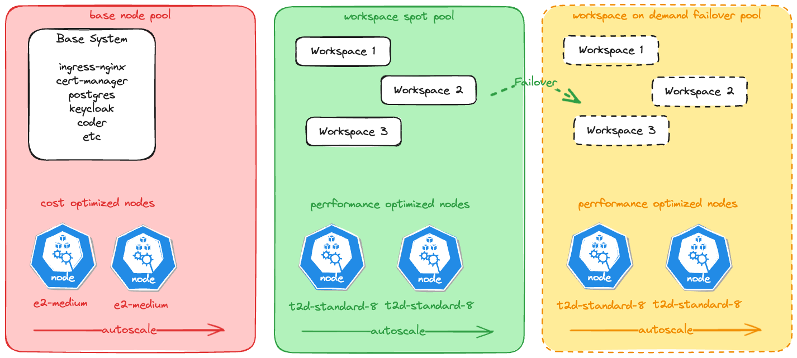

# Cloud cost optimization

Here some points to consider when optimizing cloud costs:

 * **Do not run things you do not use.**
 * Use the right instance type for the right job.
 * Use spot instances for non-critical workloads.

We follow this topics in the deployment of coder development cluster in the Google Cloud Platform.

Here is the picture:

